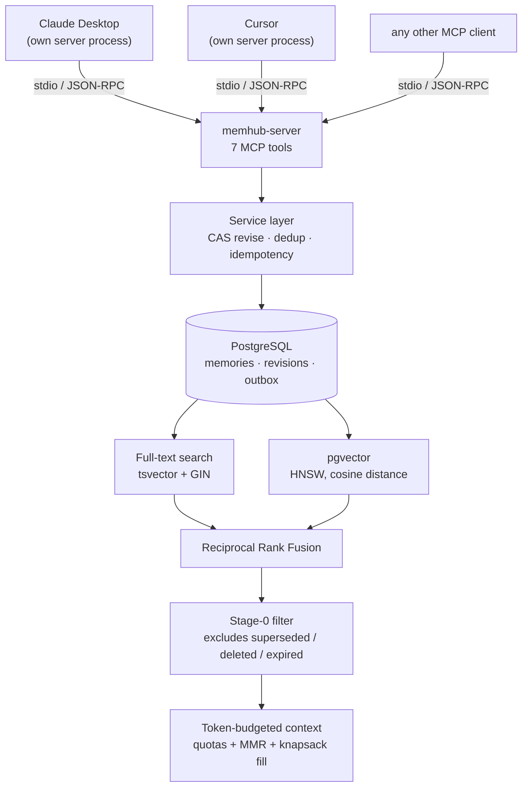
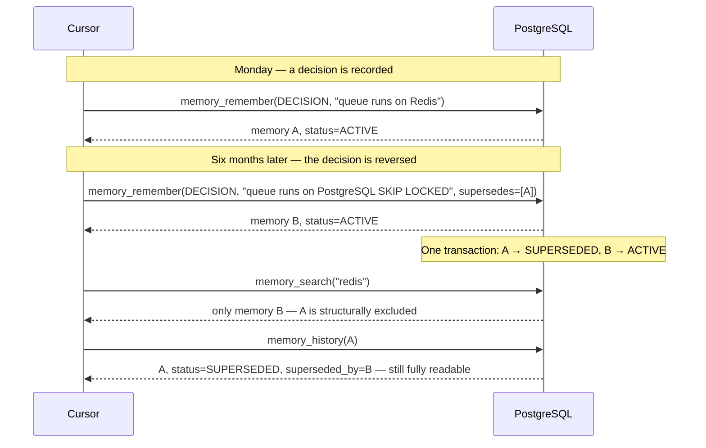
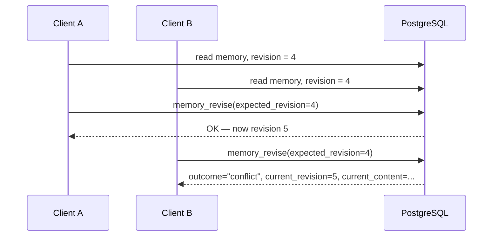

# MCP Shared Memory Server

**A PostgreSQL-backed memory service that lets multiple MCP clients share, revise, and search a project's knowledge without ever resurfacing a decision that has been replaced.**

[](https://github.com/shirisha456/mcp_shared_memory_server/actions/workflows/ci.yml)


Claude Desktop, Cursor, and Claude Code each keep their own context today — a decision explained to one is invisible to the others, and every new session starts from zero. This is a single MCP server, backed by one PostgreSQL database, that gives all of them one shared, versioned memory: conflict-safe writes, immutable revision history, hybrid keyword + vector search, and a structural guarantee that a replaced decision can never resurface as a search result. No separate vector database, no Redis, no Kafka — just PostgreSQL, which a backend project already needs anyway.

---

## The problem

Developers don't use just one AI coding tool. Someone explains a decision to Claude Desktop, then switches to Cursor for a different task — and Cursor has no idea what was just decided, because it never saw that conversation. Every tool starts from zero, every time.

The fix sounds simple: give every tool one shared place to read and write project knowledge. Giving one AI assistant a memory *is* simple — a text file it can read. Sharing that memory correctly across **several different clients** is where it gets hard, because now:

- two clients can try to update the same fact **at the same time**
- a decision made last month can be **reversed**, and the reversal has to actually take effect everywhere
- the old decision still needs to be **auditable** — someone will ask why it changed
- if the old and new versions are both left retrievable, a similarity search can return the **wrong one**, because the retired phrasing often matches the query better than the current answer does
- lexical and semantic search each miss things the other catches, so neither alone is enough
- whatever gets retrieved has to fit inside a **token budget**, not just be sorted by relevance
- every client has to reach all of this through the **same protocol**, not a bespoke integration each

Storing a fact is easy. Correctly *retiring* one — so it can never come back, however it's searched for, while still remaining in the audit trail — is a concurrency and retrieval problem.

## What this project solves

Every MCP client reads and writes one shared, versioned memory. Two clients writing at once are resolved safely, not silently overwritten. When a fact is replaced, the old version is marked as replaced in the same transaction as the new one — it stays fully readable in the audit history, but it can never come back as a search result again.

That last guarantee is structural, not a ranking decision: a replaced fact is excluded from retrieval *before* any scoring runs, so no query and no similarity match can bring it back.

**Token cost is measured, not asserted.** Sending the full 200-memory evaluation corpus as context costs about 7,583 tokens. A single `memory_context` call at its default 2,000-token budget returns the 44 most useful, non-redundant memories using 1,797 tokens — a **4.2x reduction, computed by running the actual selection code against the actual corpus**, not a number written into a README by hand. Full method in [`docs/eval/tokens.md`](docs/eval/tokens.md).

## Architecture



Each client spawns its **own** copy of the server as a subprocess — they share no memory and no cache. PostgreSQL is the only channel between them, which is what makes the concurrency control below a real requirement rather than a nice-to-have.

**What this server actually sees:** the arguments of the tool calls made to it — nothing more. It does not receive conversation transcripts, and it has no access to a client's chat history. This is a *shared memory system*: clients explicitly decide what's worth recording. It is not, and will never be, a transparent chat-history synchronisation system.

## Why vector search alone isn't enough

Embedding a memory, storing the vector, and running nearest-neighbour search gets you a working prototype quickly. It also breaks the moment a memory is revised, because nothing about that approach stops the old embedding from still being the closest match to a new query.

What sits above the vector database is what makes revision safe: conflict-safe writes, immutable revisions, supersession, and a structural filter that excludes retired memories before ranking ever runs — all wrapped in one hybrid retrieval path and exposed over MCP.

## Revision history and supersession

Two distinct mechanisms, both immutable, and worth telling apart:

- **`memory_revise`** creates a new revision **of the same memory** (revision 1 → 2 → 3...), guarded by compare-and-set. Use it to correct or extend a fact's wording.
- **`memory_remember ... supersedes=[...]`** retires **one memory** and asserts a **new, separate one** in its place, in a single transaction. Use it when the decision itself changes.



The exclusion of `A` is not a ranking decision — a similarity search would happily return it, since it literally contains the word "Redis" and the replacement barely mentions it. It's a filter every retrieval path runs *before* ranking ever sees a candidate. `tests/integration/test_stale_memory.py` asserts this at every limit from 1 to 100, and mutation-testing the filter — removing the status condition — makes five of those tests fail.

## Concurrent writes

Two clients can read the same revision and try to update it at the same time. One has to win, and the other has to be told it lost — not silently overwritten.



`memory_revise` is a single-statement compare-and-set:

```sql
UPDATE memories SET current_revision_no = current_revision_no + 1
 WHERE id = :id AND project_id = :pid AND current_revision_no = :expected AND status = 'ACTIVE'
```

Zero rows updated means another writer already moved the revision forward. The correctness argument is `EvalPlanQual`: when a blocked transaction unblocks, PostgreSQL re-evaluates this `WHERE` clause against the newest committed row, so the read and the write happen as one statement — there is no window in which a second writer could have proceeded on stale information. `READ COMMITTED` is chosen deliberately over `SERIALIZABLE` for this: `SERIALIZABLE` would turn every losing writer's clean, informative refusal into an opaque `40001` retry.

`tests/concurrency/` proves it directly: 50 writers launched from a barrier so they collide for real, exactly 1 succeeds and 49 receive a conflict with the winning revision attached, then the invariant suite confirms the database agrees. Removing the version predicate from the SQL is a one-line change that makes those tests fail — verified.

**A separate mechanism handles the other half of correctness under concurrency.** Idempotency is *one* client retrying *the same request* after a dropped connection — keyed on a caller-supplied `client_request_id`, the retry replays the original stored response rather than writing twice. Deduplication is *two different clients* independently asserting *the same fact* — keyed on a normalised content hash, it returns the existing memory and records the second assertion as corroborating evidence, not a duplicate. They're easy to conflate and solve different problems; `tests/concurrency/test_idempotency.py` keeps them distinct.

## Retrieval architecture

Full-text search and pgvector similarity both run over the *same* stage-0 filter, then their rankings are combined by **Reciprocal Rank Fusion** — position, not score. `ts_rank_cd` is unbounded and corpus-dependent; cosine distance lives in `[0, 2]`. Adding the two numbers together is meaningless, and per-query normalisation is worse: it scales a mediocre best match up to 1.0, identically to a perfect one.

| Mechanism | What it's for |
|---|---|
| PostgreSQL full-text search | exact terminology, identifiers, names — things a stemmer or embedding model can miss |
| pgvector similarity | meaning without the exact words, e.g. `jwt` finding a memory that only says `JWTs` |
| Reciprocal Rank Fusion | combining two rankings that live on incompatible scales, without inventing a shared one |
| Stage-0 filter | structurally excludes superseded / deleted / expired memories, before ranking ever runs |
| Token-budgeted context | keeps a caller's context window from being overrun, with per-type quotas and MMR diversity |

Approximate nearest-neighbour search returns the *k* closest vectors whether or not anything is actually close, so a cosine-distance threshold (`0.35`) gates the semantic leg — chosen by sweeping against the corpus, not by intuition (see [`docs/eval/threshold-sweep.md`](docs/eval/threshold-sweep.md)). Without it, hybrid retrieval scored a better nDCG (0.881) while precision collapsed to 0.113, because every unanswerable query started returning ten confident-looking irrelevant results.

## Retrieval quality — measured

A hand-graded dataset of 200 memories and 34 queries, written **before** any retrieval strategy was measured against it. Numbers are gated against a committed baseline, so a regression fails the build rather than going unnoticed.

| Strategy | nDCG@10 | Recall@10 | Precision@10 | Stale memories returned |
|---|---|---|---|---|
| Full-text, all terms required | 0.478 | 0.468 | 0.484 | 0.000 |
| Full-text, any-term fallback | 0.803 | 0.817 | 0.691 | 0.000 |
| Hybrid: FTS + pgvector, RRF | **0.853** | **0.828** | 0.671 | **0.000** |

The last column is the point, not the first three. A retired memory reached a caller **zero** times, at every strategy, every token budget, and every query — including one built specifically to defeat a similarity-only system: searching `"redis"` when the retired memory is about Redis and the current answer mentions it only to say it was removed.

The `jwt` query went from 0.000 (the Snowball stemmer never matches `JWTs`) to a perfect 1.000 under hybrid, because semantic similarity does bridge that gap. `deadlock prevention` stays at 0.000 either way — the matching memory describes deadlock prevention without ever using the phrase, and 384 dimensions of a small local model don't close that particular gap. Recorded as an open case, not smoothed over.

## Consistency guarantees

Precise claims only — no "strong consistency" without saying what that means here.

- **A stale write can never overwrite the current revision.** Enforced by the compare-and-set above, not by application logic.
- **Exactly one current revision per memory, at all times.** `UNIQUE (memory_id) WHERE is_current` — a database constraint, not a convention.
- **Superseded, deleted, and expired memories never appear in normal retrieval**, from a single stage-0 predicate that every retrieval path runs through.
- **A memory can only be superseded within its own project.** A composite foreign key makes cross-project supersession structurally unrepresentable, not merely disallowed.
- **Every timestamp is the database's clock**, never an application clock — so there is no clock-skew window between processes to reason about.
- **Content is never destroyed by a normal operation.** Revisions are append-only; the one destructive path (`memhub-admin purge`) is a separate, audited, human-invoked operator command, deliberately unreachable over MCP.

9 of the 14 invariants in [`docs/architecture.md`](docs/architecture.md#13-invariants-enforced-not-documented) are enforced at the schema level, so they hold even if a bug reaches the service layer. `tests/integration/test_invariants.py` proves each one by bypassing the service layer entirely and attempting the forbidden write directly against the database.

## Failure model

Driver-level failures are classified into codes that say what to do next — the distinction between them is the point, not the count:

| Code | Safe to retry | Because |
|---|---|---|
| `BACKEND_UNAVAILABLE` | yes | the connection never opened; nothing ran |
| `BACKEND_BUSY` | yes | the pool timed out before a statement was sent |
| `UNKNOWN_OUTCOME` | **no** | the connection died mid-flight; the write may have committed |
| `DEADLINE_EXCEEDED` | no | the query was too slow; the server itself is healthy |

`UNKNOWN_OUTCOME` is the one genuinely ambiguous case: the transaction either committed just before the connection dropped, or it didn't, and the acknowledgement that would have said which is exactly what was lost. So the response doesn't claim the write failed — it names the two ways to find out: replay the idempotency key, or re-read. That branch ordering is mutation-tested: inverting it makes three tests fail, because it would report every mid-flight disconnect as safely retryable, which is how duplicate writes happen.

[`docs/failure-modes.md`](docs/failure-modes.md) maps every failure the architecture claims to handle to the specific test that proves it, and states plainly which ones are structural arguments rather than tests — and why a test there would just be testing PostgreSQL.

## Testing strategy

369 tests, organized by what they're actually checking, not just counted:

| Category | What it proves |
|---|---|
| `tests/unit/` | Domain logic in isolation — validation, token estimation, ranking math, no database |
| `tests/integration/` | Real behaviour against real PostgreSQL — no mocked database anywhere in the suite |
| `tests/concurrency/` | Conflicting writes are actually adjudicated: 50 real writers, exactly 1 winner |
| `tests/failure/` | Driver failures classify correctly; schema drift is refused in both directions |
| `tests/perf/` | Search latency and cost-vs-corpus-size, measured against a budget, not eyeballed |
| `tests/protocol/` | The actual MCP stdio transport, spawned as a real subprocess — not an in-process shortcut |
| `tests/eval/` | Retrieval quality against the graded dataset, gated against a committed baseline |

A few tests worth naming specifically: the 50-writer compare-and-set test only passes for the right reason because a fixture first asserts the connection pool can supply 50 distinct backends — otherwise a 50-way test against a 10-connection pool just measures five sequential waves. The stage-0 filter and the failure classifier's branch order are both **mutation-tested**: the mechanism is deliberately broken, the relevant tests are confirmed to fail, then it's restored — the only real evidence a test was checking anything at all.

## Performance and scaling

Measured at three corpus sizes, on a local Docker Desktop PostgreSQL instance, server time from `EXPLAIN ANALYZE` and client time including transport overhead:

```
  1,000 memories   server  0.36ms   client  5.34ms
 10,000 memories   server  0.53ms   client 11.00ms
100,000 memories   server  0.67ms   client 22.80ms
```

Corpus grew 100×; server-side query time grew 1.9×. The gap between server and client time is Docker Desktop's port forwarding, not query cost — the benchmark reports both separately rather than folding the overhead into one misleading number. At 100,000 rows the planner still chooses a sequential scan over the GIN index, correctly: with `LIMIT 10`, the scan stops as soon as it has ten matches, before an index lookup plus heap fetches would have paid for themselves — recorded in [`docs/perf/scaling_plan.txt`](docs/perf/scaling_plan.txt) rather than asserted on, after two earlier versions of this benchmark asserted the wrong thing.

This measures one selective query at three corpus sizes on one machine — it demonstrates sub-linear growth for that query shape, not a general scalability claim.

## MCP protocol and tool surface

[MCP](https://modelcontextprotocol.io) gives an AI client a standard way to discover and call tools exposed by a separate process. It's the transport; the engineering in this repository is the memory-consistency, revision, retrieval, and concurrency layer sitting behind it; the seven tools below are a thin surface over the service layer described above.

| Tool | Purpose |
|---|---|
| `project_use` | Resolve or explicitly create a project namespace. Never creates implicitly. |
| `memory_remember` | Record one durable piece of knowledge; optionally `supersedes` an earlier one. |
| `memory_revise` | Update a memory, guarded by `expected_revision`. A conflict returns the winning version, not an error. |
| `memory_forget` | Tombstone a memory. Reversible — content is never destroyed. |
| `memory_search` | Retrieve active memories. Superseded, deleted, and expired are never returned. |
| `memory_history` | Full record for one memory, including retired ones: revisions, lineage, audit. |
| `memory_context` | The most useful brief that fits a token budget — selection under a constraint, not search. |

The manifest — names, descriptions, schemas — is snapshotted to [`tests/protocol/manifest.json`](tests/protocol/manifest.json) and asserted every run, because tool descriptions are the prompt that steers the calling model: a wording change alters behaviour with no logic change, and the snapshot turns that into a visible diff.

## One workflow, end to end

```
1. Claude Desktop remembers: "The job queue runs on Redis."          [session ends]
2. Cursor, a separate process sharing nothing but the database,
   searches "queue" — finds it, with author_client recorded.
3. Months later, Cursor remembers the replacement, superseding #1
   in the same transaction.
4. Search for "redis" now returns only the current answer, even
   though #1 still contains that exact word.
5. memory_history on #1 shows it as SUPERSEDED, not gone.
```

A runnable version of this is in [`demo.py`](demo.py) — it drives the real stdio transport and prints the actual tool responses.

## Quick start

```bash
docker compose up -d --wait        # PostgreSQL 16 + pgvector
pip install -e ".[dev]"
alembic upgrade head
pytest -v                          # 369 tests against the real database
python demo.py                     # watch the workflow above run for real
```

Connecting a real client (Claude Desktop, Cursor) is covered in [`docs/clients.md`](docs/clients.md).

## Repository structure

```
src/memhub/
  domain/          pure types, policy, validation, normalisation — no I/O
  services/        transactions, invariants, policy — no MCP awareness
  persistence/     ORM models, repositories (every method requires a project scope)
  retrieval/       filters.py, semantic.py, fusion.py — the stage-0 filter, written once
  embeddings/      the port, a local model, and a deterministic fake for CI
  mcp/             thin handlers, schemas, error mapping, stdio entry point
  cli/             operator commands (purge, gc, status) — deliberately not over MCP
  observability/   JSON logs to stderr; in-process metrics registry
migrations/        async Alembic
tests/             unit, integration, concurrency, failure, perf, protocol, eval
docs/architecture.md   the full design, including what was deliberately not built
docs/failure-modes.md  every failure the design claims to handle, mapped to its test
```

## Key design decisions

**PostgreSQL as the only source of truth, including as a job queue.** Embedding generation is enqueued via `FOR UPDATE SKIP LOCKED` in the same transaction as the write it's for — both exist or neither does. No Redis, no Kafka: the durability and transactional guarantees a job queue needs were already sitting in the database being written to anyway.

**Hybrid FTS + pgvector over a separate vector database.** Both retrieval paths run inside the same transaction boundary as the stage-0 filter, so "superseded memories are excluded" is one guarantee instead of two systems that have to agree.

**Optimistic concurrency (compare-and-set) over pessimistic locking.** A conflicting writer gets an immediate, informative refusal with the winning revision attached, instead of blocking behind a lock or receiving a generic serialization failure.

**Reciprocal Rank Fusion over score blending.** Lexical and vector scores live on incompatible, unbounded scales; combining rank positions sidesteps needing a shared scale at all.

**Structural exclusion over ranking-based suppression.** A retired memory is removed from the *candidate set* before any ranking runs, so no scoring function — today's or a future one — can accidentally resurrect it.

**Immutable revisions and append-only history.** Nothing is ever overwritten; a mistaken decision is recorded as superseded, not erased, because the audit trail is part of the product.

## Tech stack

**Language:** Python 3.12
**Protocol:** MCP (`mcp` SDK v2), stdio transport
**Persistence:** PostgreSQL 16, SQLAlchemy 2.x (async), asyncpg, Alembic
**Retrieval:** PostgreSQL full-text search, pgvector (HNSW), `BAAI/bge-small-en-v1.5` via `fastembed`
**Testing:** pytest, pytest-asyncio, real PostgreSQL throughout — no mocked database
**Infrastructure:** Docker Compose

## Project status and limitations

| # | Milestone | State |
|---|---|---|
| 0 | Skeleton: Docker, Alembic, logging, test harness, CI | done |
| 1 | Projects, memories, immutable revisions, 3 MCP tools over stdio | done |
| 2 | Compare-and-set revise, idempotency, audit log, metrics | done |
| 3 | Deduplication, attestations, supersession, forget, history | done |
| 4 | Claude Desktop / Cursor integration, golden manifest | done |
| 5 | Full-text retrieval | done |
| 6 | Evaluation harness (before vectors, deliberately) | done |
| 7 | pgvector, embedding outbox, hybrid RRF ranking | done |
| 8 | Context builder under a token budget | done |
| 9 | Failure injection, retention, operator CLI, scaling benchmarks | done |

**Not built:** an OTLP/Prometheus metrics exporter (metrics are collected in-process only — nothing scrapes or receives them yet), MCP resource subscriptions, and a shared-process Streamable HTTP transport for scenarios where stdio's one-process-per-client model doesn't fit.

## Recommended engineering improvements

Honest gaps, not disguised as finished work:

- **No authentication or authorization layer.** Any process that can reach the configured `MEMHUB_DATABASE_URL` can read and write any project. Fine for the single-user local stdio deployment this targets; a real gap the moment a shared server serves multiple untrusted callers.
- **No metrics exporter.** The in-process registry enforces label-cardinality discipline correctly, but nothing currently scrapes or receives it — there's no operational visibility outside the structured logs.
- **stdio is single-tenant per client process.** A long-lived server handling many concurrent client connections needs the Streamable HTTP transport, which is a real design change (auth, per-caller authorization), not a flag flip.
- **Retention is manual.** `memhub-admin gc` collects spent idempotency keys and dead embedding jobs, but nothing schedules it — it has to be invoked, by a human or an external cron, not by the system itself.

## License

MIT
